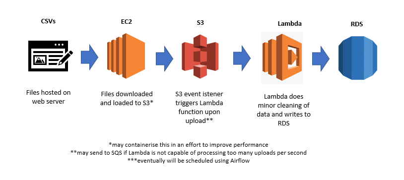

# un_data_aggregator
Repo using big data tech to find and aggregate open source humanitarian data.

The idea behind this project is to bring humanitarian data files into a data pipeline, aggregate them, and make
them available via a RDBMS, API or data warehouse.

Source: https://data.humdata.org/

**Current process flow:**

**Eventual desired process flow:**
  - run web scraper on EC2 instance and save data to S3 bucket
  - deploy zipped code to S3 bucket
  - launch an AWS EMR cluster to read code from S3 bucket
  - process scraped data in S3 bucket
  - have the output of Spark job write result to S3
  - run COPY command to write to Redshift data warehouse
  - schedule periodic backups of Redshift cluter
  - add script to restore Redshift cluster from backup
 
Note 22/4:
- Initially tried writing to DynamoDB then realised that I was quickly exceeding the provisioned write capacity units
  and it wasn't going to be sustainable to write all data to DynamoDB, especially doing batch writes. 
- Therefore, will start by writing to RDS using SQL Alchemy.
- Need to redo file upload to include the column headers otherwise will be a pain writing to db.

Note 23/4:
- Have set up a listener on S3 to trigger Lambda function when a csv is uploaded to S3. Will need to see
  how Lambda handles multiple uploads per second. 
  
Note 25/4:
- After some struggle, realised that if my Lambda function is set to use the VPC that RDS is in, I need to create a
  VPC endpoint for S3, otherwise Lambda won't be able to access it...
  
Note 27/4:
- Pipeline from EC2->S3->RDS has been automated
- Lambda retries a failed attempt twice by default, so have set retries=0 and instead routes failures to an SQS queue
  where they will be picked up later.
- Failures are due to larger files exceeding the 128MB memory on a Lambda invocation. Will test with more memory.

Note 28/4:
- Upgrading Lambda memory appears to enough to process larger files (tested up to 33MB). 

Acknowledgement:
- this project uses data assembled by ACLED, which is publicly available at https://acleddata.com/#/dashboard
