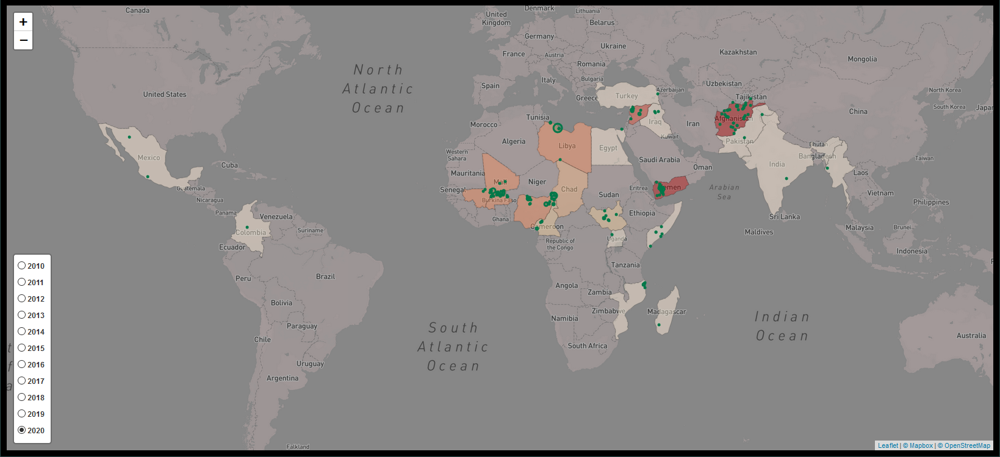

# un_data_aggregator
Repo using data engineering to find and aggregate open source humanitarian data.

The idea behind this project is to bring humanitarian data files into a data pipeline, aggregate them, and make
them available via a RDBMS, API or data warehouse.

Source: https://data.humdata.org/

[Visualisation](https://aamsi.pythonanywhere.com/) of the data by [Aamsi](https://github.com/Aamsi) : 

**Current process flow:**

**Eventual desired process flow:**
  - run web scraper on EC2 instance and save data to S3 bucket
  - deploy zipped code to S3 bucket
  - launch an AWS EMR cluster to read code from S3 bucket
  - process scraped data in S3 bucket
  - have the output of Spark job write result to S3
  - run COPY command to write to Redshift data warehouse
  - schedule periodic backups of Redshift cluter
  - add script to restore Redshift cluster from backup

Acknowledgement:
- this project uses data assembled by ACLED, which is publicly available at https://acleddata.com/#/dashboard
